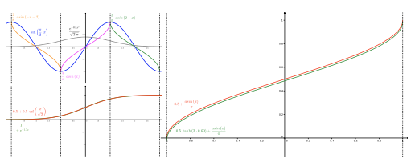
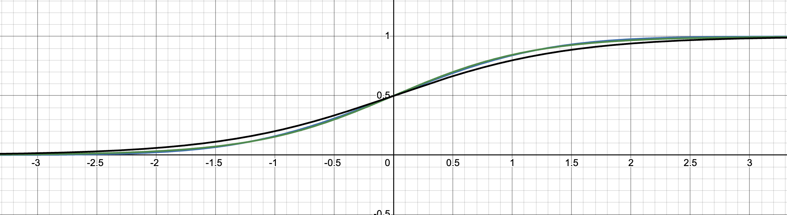
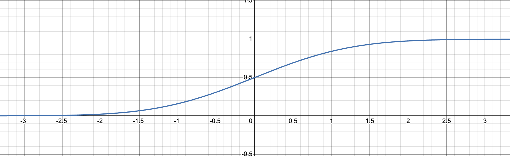
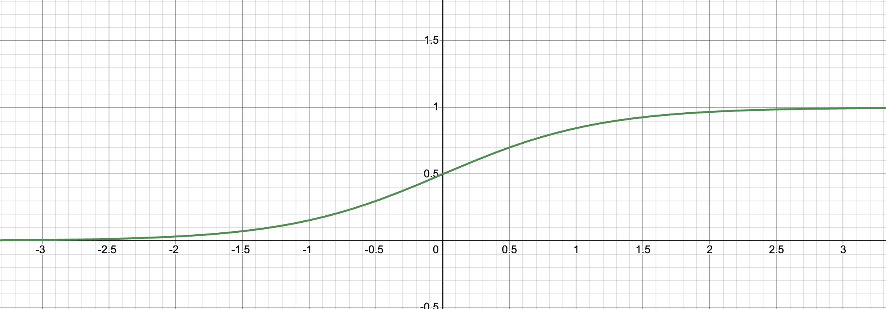
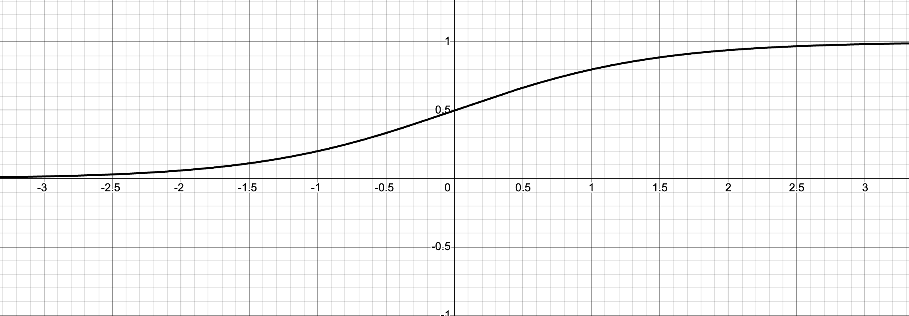

# Summary
[youtube](https://youtu.be/Q5g3p9Zwjrk?si=cxo0uor27dB-Pu8R)

Implicit Neural Representations: 어떠한 신호(이미지, 영상, 음성 등)를 인공 신경망으로 학습된 파라미터를 사용한 수식으로 나타내 연속된 공간에 나타낸다? - pros: 메모리 효율적이며 그리드 해상도에 무관함. - limitations: 신호를 고차원 미분으로 나타내야하는데, representation이 완벽하지 않음 (정보 손실?)

Previous works

- 많은 선행 연구에서는 ReLU-MLP를 이용했는데, ReLU는 2차 미분이 완전히 0이기 때문에, 한계가 존재함.
- Periodic nonlinearities: 주기를 갖는 활성화 함수를 사용한 선행 연구들
  - 푸리에 변환을 mimic한 연구도 존재
  - 근데 이 주기를 갖는 활성화 함수를 이용해서 INRs 쪽 연구한 페이퍼는 별로 많지 않았나봄

## SIREN Formula

$$F(\rm x, \Phi, \nabla_x\Phi, \nabla_x^2\Phi, \dots) = 0, ~~ \Phi: \rm x \mapsto \Phi(\rm x) ~~~~~~~~~~~~~~~~~~\cdots(1)$$

시-공간 좌표 x와, x를 $\Phi(\rm x)$에 매핑하는 함수 $\Phi$의 미분들을 입력으로 받아 0을 리턴하는 함수 F를 찾는다는 것 -> 실제 signal을 인공신경망 학습을 통해 학습된 $\Phi$를 이용해서 수식으로 표현할 수 있다는 것.

$$\rm{find}~\Phi( \rm x) ~~ \rm{subject~~to~~} \cal{C}_m(a(\rm{x}), \Phi(\rm x), \nabla \Phi(\rm x), ...) = 0,~~\forall \rm x \in \Omega_m,~~m = 1, ...,M ~~~~~~~~~~~~ \cdots (2) $$

$$\cal{L} = \int_{\Omega} \sum_{m=1}^M 1_{\Omega_m} (\rm x) \|\cal{C}_m(a(\rm x), \Phi(\rm x) \nabla\Phi(\rm x), ... ) \| \cal{d}\rm x ~~~~~~~~~~~~~ \cdots(3)$$

$$\tilde{{\cal{L}}} = \sum_{i \in D} \sum_{m=1}^M \|\cal C_m (a(\rm x_i), \Phi (\rm x_i), \nabla \Phi(\rm X_i), \dots)\| ~~~~~~~~ \cdots (3.1)$$

(2) M개의 constrain 을 만족하는 $\phi$를 찾는 것을 인공 신경망 모델의 목표로 설정할 수 있으며, 손실 함수를 (3)과 같이 표현할 수 있다. 실제로 모델을 학습할 때에는 indicator function $1_{\Omega_m}$을 사용하기 보다, 실제로 $\Omega$에 속하는 데이터셋에서 샘플링하며, 이를 통해 손실함수를 (3.1)와 같이 사용할 수 있다.

### Periodic Activations for Implicit Neural Representations

$$\Phi(\rm x) = \bf W_n \phi_{n-1} \\circ \phi_{n-1} \circ\cdots\circ\phi_0)(\rm x) + \rm b_n,~~~\rm X_i \mapsto \phi_i(\rm x_i) = \sin(\bf{W}_i\rm x_i + \rm b_i) ~~~~~~~~ \cdots (4) $$

$\phi_i$는 인공신경망의 i번째 레이어를 의미하고, 위 신경망은 sin함수를 activation function으로 사용한 SIREN의 구조를 나타낸다. 기본적으로는 fully connected layer인 모습임.

> **💡NOTE**: `SIREN`의 도함수도 마찬가지로 `SIREN`이다. 이 인공 신경망 자체를 미분하게 되면, 그대로 SIREN임. sine의 미분은 cosine 이지만, phase-shifted 된 sine으로 볼 수 있고, 결과적으로 SIREN이 그대로 유지됨.

### A Simple Example: Fitting an image
2차원 이미지의 위치 좌표 $\rm x$(r, c)를 이용해서 그 위치의 색상 $f(\rm x_i)~\Bbb R^3$ (RGB)을 찾는 함수 $\Phi : \Bbb R^2 \mapsto \Bbb R^3, ~ \rm x \mapsto \Phi(\rm x)$을 만족하는 함수를 학습시킨다고 생각해보자. 이때 데이터는 $D = \{ ( \rm x_i, f( \rm x_i))\}$이다. 이때, 인공 신경망의 제약(조건)인 $C$는 $\Phi$가 `이미지 좌표`를 받아서 `이미지 색상`을 출력하게 만든다. 이 제약은 $C(f(\rm x_i), \Phi(\rm x)) = \Phi(\rm x_i) - f(\rm x_i)$로 나타낼수 있으며, 

따라서 `손실함수` $\tilde{\cal L} = \sum_i \|\Phi(\rm x_i) - \cal f(\rm x_i)\|^2$를 사용할 수 있다.

## Initialization
> (4)에서 언급한 모델 구조를 보면, 기본적으로 Fully connected layer의 형태로, 가중합에 활성화 함수를 통과시킨 꼴이다. `가중치(W)`를 **Uniform distribution**으로 초기화하고, `입력(X)`가 **arcsine distribution**일때, `가중합` ($\rm w^T\rm x$)는 **Normal distribution**이 된다고 증명함. 마지막으로 정규 분포를 따르는 가중합을 sin함수의 입력으로 넣을 경우, `출력`$\sin(\rm w^T \rm x)$은 **arcsine distribution**이 되어, 입력과 출력의 분포 형태가 동일하게 된다.

#### 더 자세히 다루기 전에, `supplement`에서 제시한 위 가정의 증명부터 알아보자.
----

#### Definition 1.1
*The arcsine distribution is defined for a random variable* $X$ *by its cumulative distribution function (CDF)* $F_{\rm X}$ *such as:*
$$X \thicksim \rm{Arcsin}(a,b), \rm{with} ~\it{CDF}:~F_{X}(x) = \frac 2 \pi \arcsin(\sqrt\frac {x-a} {b-a}), \rm{with} ~ b > a$$

#### Lemma 1.1
*Given* $X \thicksim U(-1, 1)$ *and* $Y = \sin(\frac \pi 2 X)$ *we have* $Y \thicksim \rm{Arcsin}(-1, 1)$

***Proof***. $X \thicksim U(-1, 1)$ 인 x에 대해서, [-1, 1] 구간에서 확률 밀도 함수(pdf) $\cal f(x) = \frac 1 2$로 정의된다. 따라서, 누적 확률 분포 함수가 $F_{\rm X}(x) = \Bbb{P}(\rm X \leq x) = \frac 1 2 x + \frac 1 2$ 임은 쉽게 알 수 있다.  
우리는 sin함수를 통과한 출력 값인 $Y = \sin(\frac \pi 2 \rm X)$의 분포가 어떻게 되는지 알아보고자 한다.
$$F_Y(y) = \Bbb{P}(\sin(\frac \pi 2 X) \leq y) = \Bbb P (X \leq \frac 2 \pi \arcsin y) = F_X(\frac 2 \pi \arcsin y)$$

$$F_Y(y) = F_X(\frac 2 \pi \arcsin y) =\frac 1 \pi \arcsin y + \frac 1 2 ~~~~~\because F_X(x) = \frac 1 2 x + \frac 1 2$$

- pdf: $\frac d {df} F_Y(y) = \frac 1 \pi \frac 1 {\sqrt1 - y^2}$
> **💡NOTE**: Arcsine distribution의 누적 분포 함수(CDF)는 $F(x) = \frac 2 \pi \arcsin(\sqrt x) = \frac {\arcsin(2x - 1)}{\pi} + \frac 1 2$ 이다. 이때, x는 구간 [0, 1]에서 만족하는데, 위 $F_Y(y)$의 경우 **Arcsine distribution**의 누적 분포 함수와 동일한 형태를 가지고 있으며, $0 < x < 1$ 인데, $y = 2x -1$ 이므로, $-1 < y< 1$ 에서 **Arcsine** 분포를 따른는 것을 알 수 있다.

#### Lemma 1.2
*The variance of* $mX + n$ with $X$ *a random variable and* $m \in \Bbb R^+_{/0}, n \in \Bbb R$ *is* $\rm{Var}[mX+n] = m^2\rm{Var}[X]$

***Proof***. 임의의 확률 번수가 연속된 확률 밀도 함수 $f_X$를 따른다고 할때,  기대값은 $\rm E[X] = \int_{-\infty}^{\infty} \cal f_X(x)dx$ 로 정의되며,  분산은 $\rm{Var}[X] = \rm E[(X - \rm E[X])^2] = \rm E[X^2] - \rm E[X]^2$로 정의된다.

**따라서**, $\rm{Var}[mX + n] = \rm E[(mX + n)^2] - \rm E[mX + n]^2 = \rm E[m^2X^2 + 2mnX + n^2] - (m\rm E[X] +n)^2 = m^2(\rm E[X^2] - \rm E[X]^2) = m^2\rm{Var}[X]$

#### Lemma 1.3
*The variance of* $X \thicksim \rm {Arcsin}(a,b)$ is $\rm{Var}[X] = \frac 1 8 (b-a)^2$

***Proof.*** $Z \thicksim \rm {Arcsin}(0,1)$ 이면, $\rm{Var}[Z] = \frac 1 8$이고, $\rm E[Z] = \frac 1 2$ 임을 계산을 통해 구할 수 있다. 그리고, $\rm Var[Z] = \rm E[Z^2] - \rm E[Z]^2 = \rm E[Z^2] - \frac 1 4$임을 구할 수 있다.  즉 분산을 구하기 위해선, $Z^2$의 기대값을 구하면 된다.

$$ \rm E[Z^2] = \cal \int_0^1 z^2 \cdot \frac 1 {\pi\sqrt{z(1-z)}}dz = \frac 2 \pi \int_0^1 \frac {t^4}{\sqrt{1-t^2}} dt = \frac 2 \pi \int_0^{\frac \pi 2} \sin^4  u~du = \frac 3 8$$

- **치환 과정**
    1. $z = t^2, ~ dz = 2t$
    2. $t = \sin(u), dt = \cos(u) du$

$X = mZ +n $이고, $n = a, m = b- a$ 이면, $X \thicksim \rm{Arcsin}(m\cdot 0 + n, m\cdot 1 + n) = \rm{Arcsin}(a,b)$

$X \thicksim \rm{Arcsin}(a,b)$ 이고 $Z \thicksim \rm{Arcsin}(0, 1)$ 이라고 하자. 
위에서  $X \thicksim \rm{Arcsin}(\alpha, \beta)$ 일 경우, $X$의 선형 조합인 $mX + n \thicksim \rm{Arcsin}(\alpha m + n, \beta m + n)$임을 증명 했다. (Lemma 1.1) 
$X = mZ + n$ 으로 나타낼 수 있으며, 이때, $X = mZ + n \thicksim \rm{Arcsin}(0 \cdot m + n, 1 \cdot m + n) = \rm{Arcsin}(a,b)$ 임으로

$$0 \cdot m + n = a ~~~~\therefore n = a \\ 1 \cdot m + n = b ~~~~\therefore m = b - a$$

**최종적으로 아래와 같이 증명할 수 있다.** 
$$Var[Z] = \frac 1 8$$
$$m = b-a$$
$$\therefore \rm{Var}[X] = \rm{Var}[m\cdot Z + n] = m^2\rm{Var}[Z] =  (b-a)^2 \cdot \frac {1} {8}$$

#### [Lemma1.4](https://www.cs.cmu.edu/~cga/var/2281592.pdf)
*For tow independent random variables* $X$ *and* $Y$
$$\rm Var [X \cdot Y] = Var[X] \cdot Var[Y] + E[Y]^2 \cdot Var[X] + E[X]^2 \cdot Y$$

***Proof:*** 
  1. 두 확률 변수 $X$와 $Y$가 독립이라고 가정. 분산 정의 사용.
  $$\text{Var} [X \cdot Y] = E[(X \cdot Y - E[X \cdot Y])^2] \cdots (1.1) \\
  E[X \cdot Y] = E[X] \cdot E[Y] \cdots (1.2)$$

  2. 독립성에 의해 전개하면
  $$ \text{Var}[XY] = {E}[(XY - {E}[X] E[Y])^2] \\
  =  E[X^2Y^2 - 2XY E[X] E[Y] +  E[X]^2 E[Y]^2] \\
  =  E[X^2Y^2] - 2E[X]E[Y]E[XY] + E[X]^2E[Y]^2$$
  $$= E[X^2Y^2] - E[X]^2E[Y]^2 ~~~~ \cdots (2.1) \\ \because E[XY] = E[X]E[Y]$$

  3. 전개 2
  $$E[X^2Y^2] = E[X^2]E[Y^2] ~~~~ \cdots (3.1)$$

  4. 분산 기본 공식 응용
  $$ \text{Var}[X] = E[X^2] - E[X]^2 \\ \therefore E[X^2] = \text{Var}[X] + E[X]^2$$
  - $Y$도 마찬가지, $(3.1)$에 대입하면
  5. (3.1)에 대입 후 정리
  $$E[X^2Y^2] = (\text{Var}[X] + E[X]^2)(\text{Var}[Y] + E[Y]^2) \\ 
  = \text{Var}[X]\text{Var}[Y] + \text{Var}[X]E[Y]^2 + E[X]^2\text{Var}[Y] + E[X]^2E[Y]^2 ~~~ \cdots (5.1)$$

6. (2.1)에 대입하여 완성
$$\text{Var}[XY] = E[X^2Y^2]-E[X]^2E[Y]^2\\
= \text{Var}[X]\text{Var}[Y] + \text{Var}[X]E[Y]^2 + E[X]^2\text{Var}[Y] ~~~~ \because (5.1) $$

#### [Theorem 1.5](https://www.cs.toronto.edu/~yuvalf/CLT.pdf)
*Central Limit Theorem with Lindeberg's sufficient condition. Let* $X_k, k\in \Bbb N$ *be independent random variables with expected values* $E[X_k] = \mu_k$ *and variances* $\text{Var}[X_k] = \sigma_k$, *Posing* $s^2_n = \sum_{k=1}^n \sigma_k^2$. *If the* $X_k$ *satisfy the Lindenberge condition:*
$$\lim_{n \rarr \infty} \frac 1 {s^2_n} \sum^n_{k=1} E[(X_k - \mu_k)^2 \cdot 1([X_k - \mu_k] > \epsilon s_n)] = 0$$

- Central limit theorem: 임의의 확률 변수들의 합은 정규 분포를 따른 다는 것임.
- 위 Lindeberge 조건을 따를 때 성립하며, 위 조건에서는 indicator를 사용해서 너무 큰 이상치가 분산에 지나치게 개입하지 않도록 방지한다. 

$$\forall \epsilon > 0; S_n = \frac 1 {s_n} \sum_{k=1}^n(X_k - \mu_k) $$
- 모든 양의 입실론에 대해서, 위 $S_n$은 n이 무한대로 갈때, `표준 정규 분포`에 수렴하게 된다.

- 증명은 넘어가도록 함.

#### Lemma 1.6
*Given a Gaussian distributed random variable* $X \thicksim N(0,1)$ *and* $Y = \sin{\frac \pi 2 X}$ *we have* $Y \thicksim \text{Arcsin}(-1, 1)$

***Proof.*** 
$X \thicksim N(\mu, \sigma^2)$의, `확률 밀도 함수(pdf)`와 `누적 확률 함수(cdf)`는 아래 와 같다
$$\text{PDF} = \frac 1 {\sigma \sqrt{2\pi}} e^{-\frac 1 2 (\frac {x - \mu} \sigma)^2}$$
$$\text{CDF} = \Phi(\frac {x-\mu} \sigma)=\frac 1 2[1+\text{erf}(\frac {x - \mu} {\sigma \sqrt 2})]$$

> **Cumulative distribution function**
> - $\Phi(x) = \frac 1 {\sqrt{2\pi}} \int_{-\infty}^x e^{-{t^2}/2} dt$
> - Error function: $\text{erf}(x) = \frac 1 {\sqrt{\pi}} \int_{-x}^x e^{-t^2} dt$ 
>   - $N(0,0.5)$의 구간[-x,x] 사이 확률값을 반환

$X \thicksim N(0, 1)$ 일때, 아래와 같이 근사할 수 있다 ($\alpha = 1.702, \beta=0.690$).
$$F_X(x) = \frac 1 2 + \frac 1 2 \text{erf}(\frac x {\sqrt 2}) \\
\approx (1 + \text{exp}(-\alpha \cdot x))^{-1} \\
\approx \frac 1 2 + \frac 1 2 \tanh(\beta \cdot x)
$$

|  **Compare Approx** |  **F(x)** 0.5 + 0.5*erf(x/sqrt(2)) |
|---|---|
|  **logistic** (1 + exp(-1.702x))^-1| **tanh** 0.5 + 0.5*erf(x/sqrt(2))|

확률 변수 $Y \thicksim \sin (\frac \pi 2 X)$ 의 누적 확률 분포 함수(CDF)를 찾아내는 것이 목표이다. Lemma 1.1과 같은 방법으로 접근해야하지만, 정규 분포는 closed form이 없다. 따라서 `표준 정규 분포`의 99.7%를 차지하는 구간 [-3, 3]에 대해서 근사하고, 다른 부분은 무시한다.

$$F_Y(y) = \Bbb P(\sin(\frac \pi 2 X) \leq y) = \Bbb P (X \leq \frac 2 \pi \arcsin y) \\

= F_X(\frac 2 \pi \arcsin y)$$
-- 모르게따 힘드라